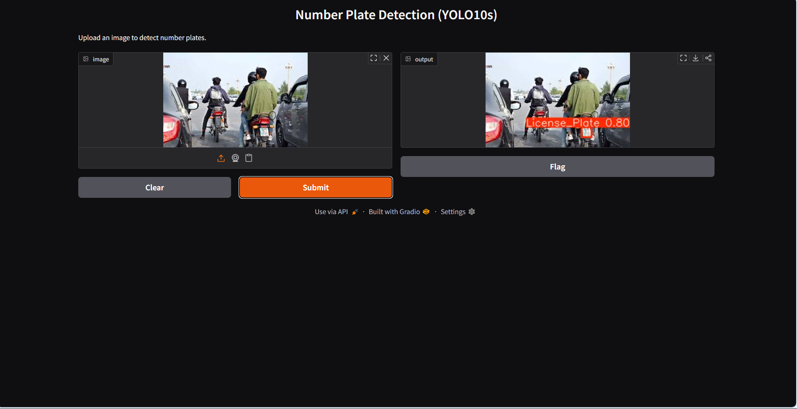
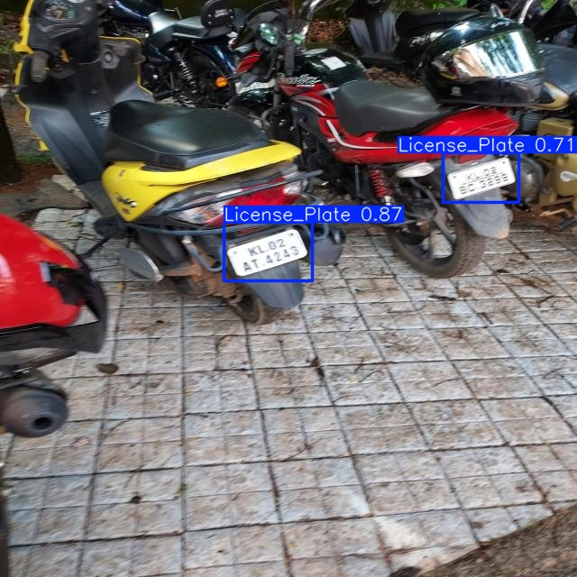
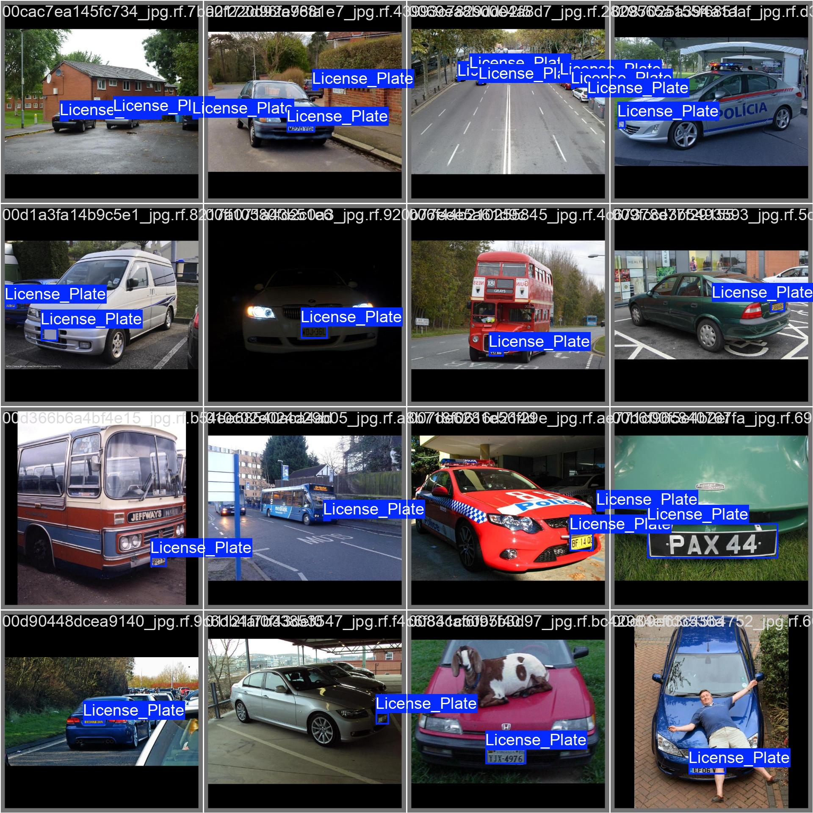

# License Plate Detection

This project focuses on detecting vehicle license plates using a YOLOv10-Small (YOLOv10s) object detection model.
The model is trained on a high-quality license plate dataset imported from Roboflow and shows strong detection performance.

The repository includes:

📒 Google Colab Notebook for training & inference

🧠 Baseline trained model (Plate_Baseline.pt)

📊 Performance report and evaluation metrics

📁 Dataset link and details

🖼️ Sample detection results and training visualizations

🌐 Live deployed Gradio app on Hugging Face Spaces

# 🚀 Live Deployment on HuggingFace

My model is deployed on Hugging Face Spaces using Gradio.

You can try the live demo here:
https://huggingface.co/spaces/Kshitij-Lalge/license-plate-detection-YOLOv10s

<p align="center">
  
</p>


# 💻 Run the App Locally

Follow these steps to run the Gradio app and YOLOv10s model locally:
## Clone the repository
```bash
git clone https://github.com/Guardian-22/License_Plate_Detection_Yolov10s.git
cd License_Plate_Detection_Yolov10s
``` 

## Install dependencies
```bash
pip install -r requirements.txt
```

## Run the Gradio app
```bash
python app.py
```

# Project Structure

```vbnet
📁 Project Structure
├── app.py
├── best.pt 
├── requirements.txt
├── README.md
└── Result/
```

# Dataset
Source: Roboflow

Annotations: YOLO Format

Automatic Train/Val/Test splitting via Roboflow API

Variety: Plates captured under multiple angles & lighting environments

Augmentation applied to improve robustness:

Rotation, flip, scale

Brightness/contrast

Blur & noise

Random cropping

Dataset Link:
https://app.roboflow.com/smarthsrp/license-plate-recognition-rxg4e-xyod6/2


# How to Use the Model

## Install Dependencies

```bash
pip install ultralytics
```
## Run Inference

```python
from ultralytics import YOLO

model = YOLO("Plate_Baseline.pt")
results=model.predict(source="path/to/image.jpg", save=True, conf=0.5)
results[0].show()

```
# Model Performance — Test Set
| Metric            | Value     | Meaning                                                            |
| ----------------- | --------- | ------------------------------------------------------------------ |
| **Precision (P)** | **0.99**  | Very few false positives — almost all detected plates are correct. |
| **Recall (R)**    | **0.946** | Most plates present in images were successfully detected.          |
| **mAP50**         | **0.979** | Excellent accuracy at IoU 0.5 — strong model confidence.           |
| **mAP50-95**      | **0.728** | Good performance under stricter IoU thresholds.                    |

# 📸 Sample Detection Results

Here are some examples of the model detecting license plates:

<p align="center">
  
  <br>
  <em>Single Image Inference</em>
</p>

<p align="center">
  
  <br>
  <em>Model performance on multiple images in a batch.</em>
</p>

<p align="center">
  
  <br>
  <em>Training Metrics (Precision, Recall, mAP, Loss Curves)</em>
</p>

# Contributing

Contributions, issues, and feature requests are welcome!
Feel free to fork the repository and submit a PR 🚀  

# Acknowledgements

Dataset Attribution
This project uses the "License Plate Recognition" dataset created by Roboflow (Roboflow Universe Projects).
Dataset URL: https://universe.roboflow.com/roboflow-universe-projects/license-plate-recognition-rxg4e
License: CC BY 4.0
Modifications: Images resized, augmented, and relabeled for YOLO training.


## License
This project is licensed under the MIT License.  
See the [LICENSE](./LICENSE) file for details.


